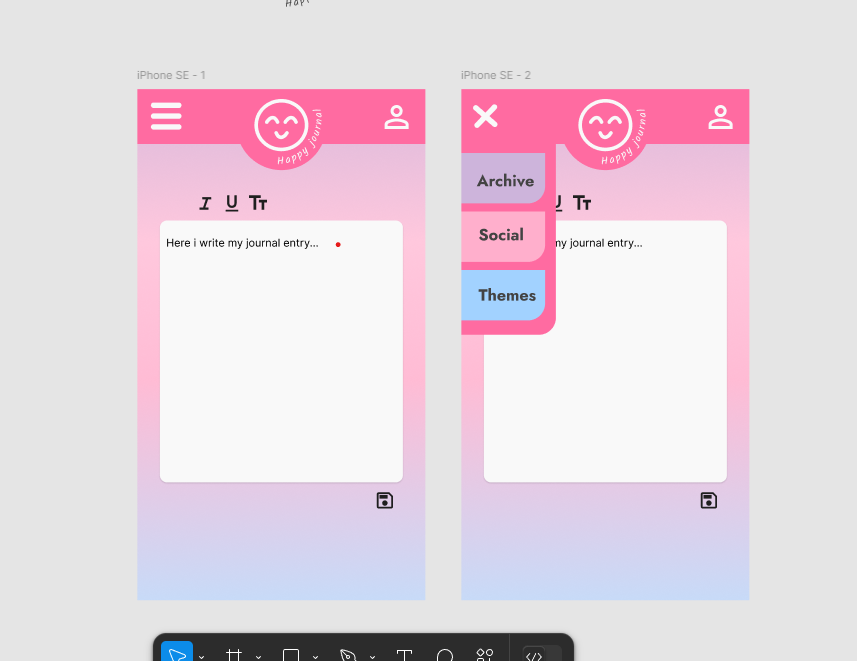
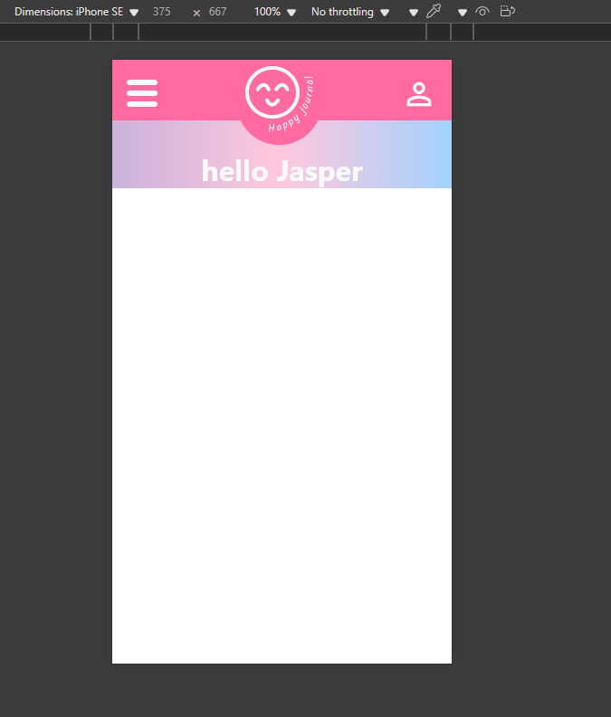

# Sophia and Jaspers common project

* At some point this might be a journal app.
* We do have the ambitions and ideas.
* Let's see where our creativity takes us

# Quickstart

1. Clone repo
2. Install dependencies and run the app
3. Visit [http://localhost:3000](http://localhost:3000)

***Linux / npm***

```shell
$ npm install
$ npm run start
```
***Mac / yarn***

```shell
$ yarn install
$ yarn start
```

***Finally:*** 
> _(See point 3 above)_


---

# Prototype



# Progress

